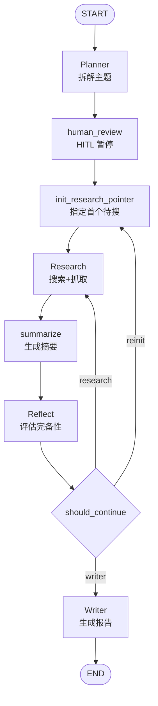
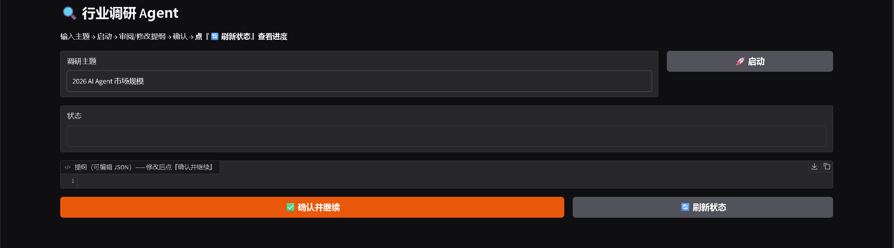
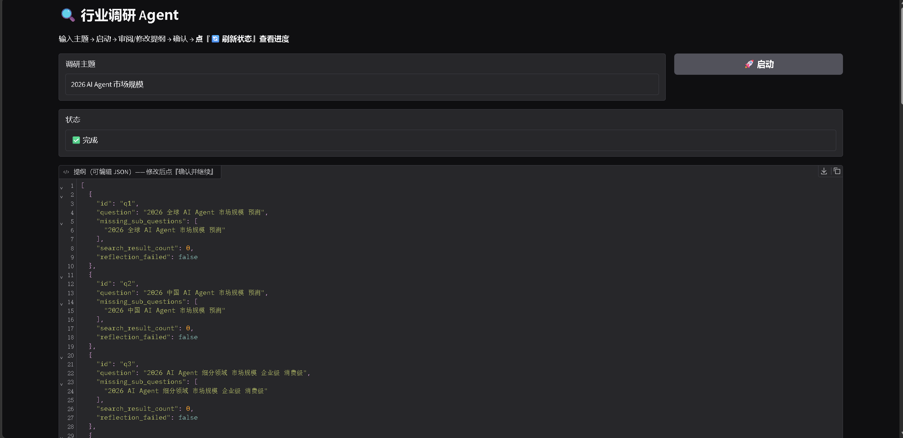
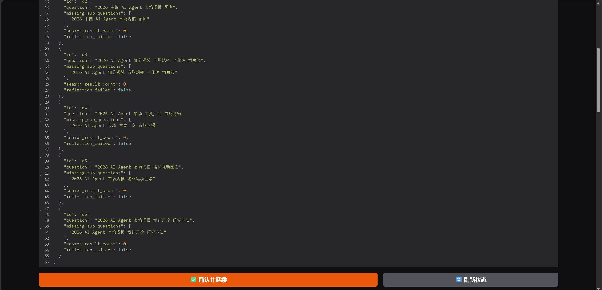

# 行业调研 Agent

基于 LangGraph 的自主调研智能体：输入主题 → 自动拆解提纲 → 联网搜索 → 
反思循环 → 生成带来源引用的结构化报告，支持人工审阅（HITL）。

## ✨ 功能
- 任务拆解（Planner）
- 联网搜索 + 网页抓取
- ReAct 反思循环（信息完备性评估 + 冲突识别）
- Human-in-the-loop（人工审阅提纲）
- 带来源引用的结构化报告

## 🏗️ 架构

### 节点（7 个）
| 节点 | 职责 | 关键设计 |
|---|---|---|
| **Planner** | 拆解主题为子问题 | 代码分配 id；调 LLM 输出 JSON |
| **human_review** | HITL 暂停等人审阅 | 无副作用节点（避免 resume 重跑） |
| **init_research_pointer** | 指定首个待搜子问题 | 位置触发；排除 reflection_failed |
| **Research** | 搜索 + 抓取 + 存正文 | 串行；URL 去重；失败跳过；统计 request_count |
| **summarize** | 为每个网页生成摘要 | 截断超长正文；失败标记 summary_failed |
| **Reflect** | LLM 评估完备性 + 指定下一个 | 覆盖 missing；防打转兜底；id 校验 |
| **Writer** | 生成结构化报告 | 代码检测硬事实标注；LLM 失败降级 |

### 边
- **普通边**（7 条）：START→Planner→human_review→init→Research→summarize→Reflect→...→Writer→END
- **条件边**（1 条）：Reflect →`should_continue`→ {research / reinit / writer}

### 循环终止条件（3 条）
1. 所有子问题 missing 为空（正常完成）
2. `iteration_count` 或 `tool_call_count` 撞上限（软停）
3. 子问题 `reflection_failed=True`（LLM 反思失败，视为已处理）

## 🛠️ 技术栈
Python / LangGraph / OpenAI API / SerpAPI / BeautifulSoup / trafilatura / FastAPI / Gradio

## 🚀 快速开始
1. pip install -r requirements.txt
2. 配 .env（见 .env.example）
3. uvicorn app.main:app --reload
4. python -m app.ui.gradio_app

## 🎯 设计亮点
- 状态机编排 7 节点 + 1 条件边
- 循环终止：全完成 / 撞上限 / 反思失败
- 防打转：prompt 约束 + 代码兜底
- 失败可区分：LLMCallError / SearchError / ScrapeError
- 降级：LLM 失败时输出原始材料
- 退避重试：LLM + 搜索

## ⚠️ 已知局限与设计取舍

### 搜索噪音

SerpAPI 返回的结果里，可能包含少量与主题无关的来源（如应用商店页、酒店官网、无关机构）。
我没有做"关键词过滤" —— 因为：

1. **关键词匹配会误伤**：中文同义词（"智能体" vs "AI Agent"）、上下位词匹配不到，
   过滤会漏掉有用来源——漏掉好来源的代价 > 多一个无关来源的代价。
2. **来源相关性是"语义判断"**：应由 LLM 判断（但会增加 LLM 调用成本），
   而非"关键词匹配"。
3. **真实调研本来就有噪音**：人工调研时也要"自己筛"。
   Agent 如实呈现搜索结果，用户在参考列表里自己判断可信度。

**补偿方案**：参考列表显示来源域名（如 `(peninsula.com)`），用户能一眼判断可信度。

**未来优化**：在 `Reflect` 里加"证据相关性评估"（LLM 判断），或"来源域名分级"（.gov/.edu 优先）。

## 📸 截图

报告结果：

2026 AI Agent 市场规模调研报告
一、2026 全球 AI Agent 市场规模预测（亿美元）
2026 年全球 AI Agent 市场规模预计约 109 亿至 121 亿美元，较 2025 年的约 76 亿至 83 亿美元显著增长，CAGR 普遍在 43% 至 50% 之间 [1]。另有口径显示，2025 年全球通用 AI Agent 市场规模达 187.3 亿美元（同比增长 112%），预计 2030 年突破 4200 亿美元，北美占 47% 份额，亚太增速最快（151%）[20]。市场共识显示客户服务/虚拟助手是最大应用场景（占 25%-33%），北美为最大区域市场（2025 年占 39.6%），且即用型 agent 销量超过自建型；消费者端 ChatGPT 以 46.4% 份额领先，企业 LLM API 端 Anthropic 以 40% 份额领先 [1]。需注意统计口径差异：Gartner 的"agentic AI"支出口径高达约 2000 亿美元，差异源于统计范围不同（狭义 AI agents 产品 vs. 嵌入式 agent 功能）[1]。从采用端看，2026 年对 1300+ 专业人士的调研显示，57% 的受访者已将 AI 代理投入生产，大型企业采用率领先（万人以上企业达 67%），客户服务和研究与数据分析是主要用例 [2]。另有数据显示 AI Agent 采用率虽高（79% 企业运行），但绝大多数项目停滞在试点阶段，难以进入生产环境，失败主因是缺乏对 Agent 运行过程的可见性 [4]。约 65-75% 的大型企业已在至少一个业务职能中使用、试点或评估 AI 代理，40% 的企业应用将嵌入任务型 AI 代理（2025 年不足 5%）[6]。Gartner 预测到 2026 年底 40% 的企业应用将默认嵌入 AI 代理（2025 年不足 5%），标志着从实验试点向主流采用的关键转折 [8]。

二、2026 中国 AI Agent 市场规模预测（亿元）
根据多家权威机构报告的交叉验证与修正，预计 2026 年中国市场将突破 2.1 万亿元人民币（CAGR 82.3%），企业运营自动化、医疗健康、金融科技、智能制造、教育科技五大垂直行业合计占比超 75% [9]。据爱分析测算，中国智能体市场规模将从 2025 年的 256.8 亿元增至 2030 年的 4925.2 亿元，CAGR 达 80.5%，其中 2028 年为关键拐点，增长动力由 IT 预算驱动转向数字劳动力双轮驱动；市场形成基础设施、操作系统、数字员工、交易生态四层架构，2030 年数字员工（2098.4 亿元，CAGR 94.9%）和交易生态（300.8 亿元，CAGR 259.6%）为增长最快层级，商业模式正从软件采购向数字劳动力交易范式跃迁 [10]。IDC 预测中国企业级 Agent 应用市场 2028 年将达 270+ 亿美元 [13]。复旦大学《2026 中国智能体经济白皮书》基于 100 个案例指出，2025 年中国市场规模约 150-250 亿元，2028 年有望突破 800-1000 亿元 [22]。企业级 AI Agent 报告显示，2025 年市场规模约 55.9 亿元、2030 年预计达 815.1 亿元（CAGR 70.9%），竞争焦点将从产品功能转向智能复利效应与复合型人才 [24]。需注意，不同机构对中国市场规模的测算口径差异较大（从百亿级到万亿级），引用时需明确统计边界。

三、2026 AI Agent 市场细分领域（企业级/消费级）规模占比
根据多家权威机构报告的交叉验证，预计到 2026 年全球 AI Agent 市场规模将达 1.28 万亿美元（CAGR 68.7%），中国市场将突破 2.1 万亿元人民币（CAGR 82.3%）；企业运营自动化、医疗健康、金融科技、智能制造和教育科技将成为前五大应用行业，合计市场占比超 75% [11]。IDC 发布两份报告指出，AI Agent 与生成式 AI 正从技术概念迈向规模化应用，分别在企业流程自动化和营销全链路场景中实现商业价值突破，并推荐了浪潮海岳、联想乐享、钉钉 AI 助理等五大典型应用；生成式 AI 营销方面已形成五层产业架构，在快消、文旅、汽车等领域落地了王老吉、西域好货仓等标杆案例 [13]。在代理商务领域，可寻址交易盘子约 2.6 万亿美元（聚焦低风险标品类目），各机构对 2030 年渗透率的共识是美国电商的 10–25%，但市场规模口径差异可达两个数量级，需注意区分交易额与软件市场概念；企业侧部署已具规模（54–58% 零售商已部署或试点），协议兼容性（ACP/UCP/AP2）正成为类似 EDI 的准入资格线，结构化数据质量直接决定商品在智能体中的可发现性，早期规模化落地集中在重复性补货与 B2B 采购场景 [16]。需注意，现有证据中关于企业级与消费级 AI Agent 的明确规模占比数据仍不充分，多数报告以垂直行业而非企业级/消费级维度切分市场。

四、2026 AI Agent 行业渗透率（金融、医疗、零售、制造）
2026 年 AI Agent 市场进入爆发期，规模从 2025 年的 184 亿美元增至 428 亿美元（+133%），预计 2031 年达 3387 亿美元（CAGR 45%），但企业部署呈现"广泛实验、有限规模化"的核心张力——88% 组织使用 AI，仅 ≤10% 实现任一职能规模化，Pilot 到规模化综合成功率仅 7.7%；科技（92%）和金融服务（85%）采用率领先，MCP 协议采用率达 67%（+274% QoQ）已成事实标准，代码 Agent 为最快落地场景；安全隐私（47%）、集成复杂性（42%）和成本超支（42%）是三大核心障碍，Gartner 预警 2027 年 40% 的 Agentic AI 项目可能被取消 [18]。根据多源行业数据，AI 正推动互联网/云计算、医疗保健、金融、制造业等十大行业加速增长，其中医疗保健以 22.17% 的复合年增长率成为增长最快的应用领域 [19]。复旦大学《2026 中国智能体经济白皮书》识别出客服、编程、营销、办公四大商业化最快场景，以及金融、医疗、制造、政务四大合同金额最大场景 [22]。在 ERP 领域，AI 正从辅助型 Copilot 迈向自主执行端到端流程的 Autonomous Operations，Gartner 预测到 2028 年嵌入式 AI 将助力企业财务结账提速 30%；该市场预计从 2025 年的 58 亿美元增长至 2035 年的 580 亿美元，但 98% 的制造商在探索 AI 的同时仅 20% 真正就绪，主要瓶颈在于数据质量、遗留系统集成和组织流程准备度而非技术本身 [7]。需注意，现有证据中关于零售行业 AI Agent 渗透率的专项数据较为有限，仅代理商务领域提供了部分参考 [16]。

五、2026 AI Agent 主要厂商市场份额与竞争格局
中国智能体数量将从 2025 年的 2,860 万个增至 2030 年的 22.16 亿个（年复合增速 139%），全球 AI 基础设施 2026-2031 年累计投入约 7.6 万亿美元，AI 正从 Copilot 迈向端到端 Agent；但 BCG/InfoQ 数据显示 60% 企业尚未在规模化层面兑现 AI 价值，工作流重构企业回报率超 65% 而点状缝补不足 15%，价值分化显著 [23]。2026 年中国 AI 大模型形成"一超三强多新锐"的梯队格局，字节、阿里、DeepSeek 领跑第一梯队，腾讯、百度、智谱等分踞垂直赛道；商业化进入兑现期，核心产业规模预计突破 1.2 万亿元，B 端 MaaS 与私有化部署为主力、C 端付费拐点显现，Agent 化与国产算力自主成为关键技术趋势 [25]。在 AI 编程细分赛道，2026 年全球 AI 编程市场规模达 128 亿美元（CAGR 24.5%），中国市场规模预计从 2025 年的 3.99 亿元增至 2026 年底的 11.73 亿元，行业已从代码补全、AI 编辑器演进至自主 Agent 阶段，全球 85% 开发者日常使用 AI 编程工具、55% 定期使用 Agent 模式；全球形成 Copilot、Cursor、Claude Code 三足格局，中国厂商以 Kimi Code 为代表，通过终端 Agent 形态、开源模型（Kimi K3，2.8 万亿参数、100 万 token 上下文）和 API 商业化（月之暗面 ARR 突破 3 亿美元、API 收入占七成）走差异化路径，同时工信部政策推动下企业级私有化部署与安全合规成为关键竞争维度 [26]。全球通用 AI Agent 市场头部五大平台占据 55.3% 市场份额，商业模式正从按调用计费向"平台+订阅+效果"混合模式转型；全球已有 34 个经济体出台专项法规，12 个将自主决策责任与审计追溯列为强制条款，政策合规与安全对齐成为行业关键变量 [20]。企业级 AI Agent 报告提出"数据-知识-智能体"智能复利增长飞轮范式，指出当前企业应用呈"浅层繁荣、广而不深"，成熟度集中在 L1-L2，预计 30%-40% 项目将在 18 个月内因 ROI 不达预期停滞 [24]。

六、2026 AI Agent 市场复合年增长率（CAGR）预测
2026 年全球大模型市场进入成熟期，规模达 4520 亿美元，预计 2030 年突破 2.68 万亿美元（CAGR 超 42.8%），技术演进呈现五大趋势：底层架构从大参数转向 MoE 稀疏架构、多模态原生融合、AI Agent 从对话进化为自主执行体、算力基础设施从训练转向推理、中美路径分化（美国追求 AGI 上限，中国通过开源与效率优化追赶）[27]。全球 Agentic AI 市场预计从 2025 年的 70.6 亿美元增至 2032 年的 932 亿美元（CAGR 44.6%），产业焦点正从模型能力转向场景理解、行业知识与商业模式的综合竞争；工业制造、能源、供应链等领域的多智能体应用加速落地，订阅制等商业模式逐步成熟，但推理成本攀升（Gartner 预计到 2028 年每个代理工作流推理成本增五倍以上）以及概率型 AI 与确定性工业系统之间的技术鸿沟仍是规模化落地的核心挑战，"只读协议"等解耦架构成为平衡智能与安全的关键路径 [29]。中国智能体数量年复合增速达 139%，全球 AI 基础设施 2026-2031 年累计投入约 7.6 万亿美元 [28]。综合各来源，全球 AI Agent 市场 CAGR 预测区间大致在 42.8% 至 68.7% 之间，中国市场 CAGR 预测普遍高于全球水平（80.5%-82.3%），但需注意各机构统计口径与预测周期存在差异 [9][10][27][29]。

参考来源

[1] AI Agents Market Size and AI Assistant Market Share in 2026 (chatmaxima.com) - https://chatmaxima.com/blog/ai-agents-market-size/ [2] State of Agent Engineering (www.langchain.com) - https://www.langchain.com/state-of-agent-engineering [3] 2026 Work Trend Index report: Agents, human agency, and ... (www.microsoft.com) - https://www.microsoft.com/en-us/worklab/work-trend-index/agents-human-agency-and-the-opportunity-for-every-organization [4] 79% of Companies Run AI Agents: 65 Adoption Stats (2026) (prefactor.tech) - https://prefactor.tech/learn/ai-agent-adoption-statistics [5] Predictions 2026: How AI Will Redefine Marketing (www.zetaglobal.com) - https://www.zetaglobal.com/en-gb/resource-center/predictions-2026-ai-marketing/ [6] AI Agent Adoption Statistics in 2026: Trends and Business ... (www.pixelbrainy.com) - https://www.pixelbrainy.com/blog/ai-agent-adoption-statistics [7] AI Agents in ERP: From Copilot to Autonomous (enersys.co.th) - https://enersys.co.th/en/insights/ai-agent-erp-copilot-to-autonomous-2026 [8] Agentic AI in Business: Driving Autonomous Decisions ... (nectarbits.ca) - https://nectarbits.ca/blog/agentic-ai-in-business-guide/ [9] AI Agent行业报告解读：2026年智能体市场规模与增长预测 (deepseek.csdn.net) - https://deepseek.csdn.net/6a312972662f9a54cb7ff53e.html [10] 中国智能体市场有多大？五年增长80.5%，市场规模将冲4900亿 (developer.cloud.tencent.com) - https://developer.cloud.tencent.com/article/2702612 [11] AI Agent行业报告解读：2026年智能体市场规模与增长预测 (blog.csdn.net) - https://blog.csdn.net/m0_62554628/article/details/161163909 [12] 2026年全球AI Agent沙箱市场深度分析：规模、竞争格局与 ... (blog.csdn.net) - https://blog.csdn.net/GlobalInfo/article/details/166130404 [13] IDC发布AI Agent企业应用与生成式AI营销双报告 (mfe-prod.idc.com) - https://mfe-prod.idc.com/getdoc.jsp?containerId=prCHC53669525 [14] AI Agent行业报告解读：2026年智能体市场规模与增长预测 (deepseek.csdn.net) - https://deepseek.csdn.net/6a312972662f9a54cb7ff53e.html [15] 2026年AI Agent行业报告：30.6%份额与1万亿美元市场规模 ... (www.baogaobox.com) - https://www.baogaobox.com/insights/260625000028145.html [16] Agentic Commerce 2026：当购物智能体开始替人下单 (clawpk.net) - https://clawpk.net/research/R-INDUSTRY-19-agentic-commerce-2026.html [17] 全球AI应⽤ 趋势洞察 (pdf.dfcfw.com) - https://pdf.dfcfw.com/pdf/H3_AP202605291822985073_1.pdf?1780041913000.pdf [18] AI Agent Adoption Report 2026 — 增强版 (segmentfault.com) - https://segmentfault.com/a/1190000047916363 [19] AI浪潮下，十大高增长受益行业全景解析 (unifuncs.com) - https://unifuncs.com/s/X9iVxGiJ [20] 全球通用人工智能体行业发展及咨询报告（2026 IIMY4U2A） (www.iim.net.cn) - https://www.iim.net.cn/106/view-252595-1.html [21] 2026年AI应用落地实战：Agent、AI编程与成本控制全解析 (bbs.csdn.net) - https://bbs.csdn.net/weixin_32296621/article/details/100360632 [22] 别只盯着大模型了！2026年真正赚钱的，是这10个智能体赛道 (www.163.com) - https://www.163.com/dy/article/L6CLRLQB05531DFD.html [23] 2026中国AI Agent企业应用市场预测报告：智能体 (www.163.com) - https://www.163.com/dy/article/L80U0ONV0518G5DJ.html [24] 2026 AI安全报告；中国企业级AI Agent发展洞察报告( 2026 ) (m.sohu.com) - https://m.sohu.com/a/1058025811_121124365?scm=10001.325_13-325_13.0.0-0-0-0-0.5_1334&spm=smwp.channel_247.block2_307_epwR4p_1_fd.2.1785715200010DA5oXoZ_324 [25] 2026年中国AI竞争格局与商业化趋势分析：梯队重构、价值兑现 (www.chinaidr.com) - https://www.chinaidr.com/tradenews/2026-05/256348.html [26] 从代码补全到自主Agent：2026年AI编程行业深度研究 (news.zol.com.cn) - https://news.zol.com.cn/1251/12519211.html [27] 大模型未来核心技术路线_全景图谱（2026-2030） (deepseek.csdn.net) - https://deepseek.csdn.net/6a686f37662f9a54cb9522c9.html [28] 2026中国AI Agent企业应用市场预测报告：智能体 (www.163.com) - https://www.163.com/dy/article/L80U0ONV0518G5DJ.html [29] 千亿美元市场!Agentic AI 的"黄金时代"何时能来? (www.eefocus.com) - https://www.eefocus.com/article/2076840.html